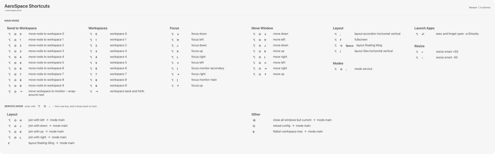

# AeroCue

A KeyCue-style cheat sheet for [AeroSpace](https://github.com/nikitabobko/AeroSpace).

Hold the **Option key** for 5 seconds and a panel appears listing every shortcut
from your `aerospace.toml`, grouped by what it does. Release Option to dismiss.

Where KeyCue shows an app's ⌘ menu shortcuts, AeroCue shows your window manager's
⌥ bindings — the ones that live in a config file and have no menu to discover them
from. The two don't conflict: KeyCue triggers on ⌘, AeroCue on ⌥.



## Features

- **Reads your real config.** Parses `[mode.*.binding]` tables from
  `~/.config/aerospace/aerospace.toml` or `~/.aerospace.toml`, re-read every time
  the sheet opens — edit your config and the next hold reflects it.
- **Grouped automatically** by command verb: Focus, Move Window, Workspaces,
  Send to Workspace, Resize, Layout, Modes, Launch Apps.
- **All modes**, not just `main`. Each non-default mode shows how to enter it
  (derived from whichever binding runs `mode <name>`), so service mode explains
  itself.
- **Sized to your display** with height-balanced columns, so it fits on one
  screen without scrolling instead of being a fixed-size scroll box.
- **Stays out of the way.** A non-activating floating panel: it never steals
  focus or switches Spaces.
- Menu bar item for hold duration (2/3/5/8s), launch at login, and reveal config.

## Requirements

macOS 13+, Swift 5.9+ (Xcode command line tools), and AeroSpace.

## Install

```sh
git clone https://github.com/ihodgy/AeroCue.git
cd AeroCue

# One-time: create a stable code-signing identity.
# Without it the app is ad-hoc signed, and since that signature changes on every
# rebuild macOS revokes the Accessibility grant each time you rebuild.
./Scripts/setup_signing.sh

./Scripts/build_app.sh --install   # builds and copies to /Applications
open /Applications/AeroCue.app
```

On first launch, grant **Accessibility** access (System Settings → Privacy &
Security → Accessibility). AeroCue needs it to observe the Option key globally;
it only watches modifier flags and never records what you type.

If the menu bar icon shows ⚠️ instead of ⌥, permission is missing — the menu has
**Open Accessibility Settings…** and **Relaunch AeroCue** to fix it.

## Usage

| Action | Result |
| --- | --- |
| Hold ⌥ for 5s | Show the cheat sheet |
| Release ⌥ | Dismiss |
| Esc or click | Dismiss |
| ⌥ + any key | Fires your normal shortcut; no sheet |

Adjust the delay under **Hold Duration** in the menu bar.

## Development

```sh
swift build -c release

# Print parsed bindings as text -- quickest way to check the parser
./.build/release/AeroCue --dump-bindings

# Render the sheet offscreen to a PNG at a given size, to check layout
./.build/release/AeroCue --render-test 3165 1229 /tmp/sheet.png
# ...optionally with a label to replace the config path shown in the header
./.build/release/AeroCue --render-test 3165 990 /tmp/sheet.png "~/.aerospace.toml"

./.build/release/AeroCue --check-trust
./.build/release/AeroCue --enable-login-item
```

## License

MIT
